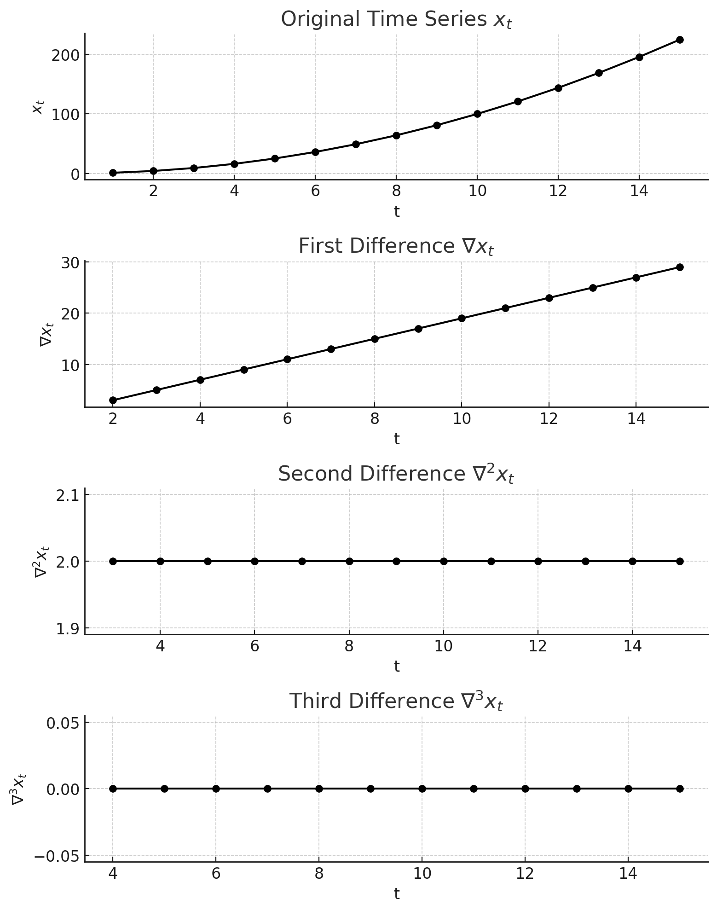

# Transforming Non-Stationary Time Series with Differencing

Some time series data follows clear trends or patterns, making it hard to model accurately. Most statistical methods assume stationarity -- meaning the average level and variability of the series stay the same over time. But real-world data rarely cooperates. Temperatures rise, economies grow, and demand cycles up and down. If you don't adjust for these trends, your models will misfire.

One of the simplest ways to fix this is **differencing**. Instead of working with the raw values, you subtract each observation from the one before it. This removes trends and makes the data more stable.

# Seeing the Effect of Differencing

To illustrate, consider a time series with a clear upward trend. It keeps climbing, making it obvious that some kind of transformation is needed. The first step is **first-order differencing**, which subtracts each value from the one before it. This flattens a linear trend into a more stable series. If the trend is more complex -- curved instead of straight -- a single difference isn't enough. A **second difference**, which applies the same operation again to the first differenced series, may be needed.

Keep going, and eventually, the data stops trending and hovers around a constant level. That's when you know you've reached a stationary series.

# How Many Differences Do You Need?

The number of differencing steps depends on the shape of the original trend.

- A steady, linear trend needs one difference.

- A curved, quadratic trend needs two.

- A more complex trend might need three or more.

Once a series is stationary, you can apply statistical models like ARIMA. These models don't work well on trending data, but they handle stationary series just fine.

# A Real-World Example: Global Temperature Anomalies

Let's apply differencing to something real -- global surface temperature anomalies from 1880 to 2020. This dataset, collected by NASA's Goddard Institute for Space Studies, measures how much the Earth's temperature deviates from a historical baseline.

## Steps:

1.  Plot the Original Data -- The raw time series shows a clear warming trend.

2.  Apply First Differencing -- This removes the linear trend, but some structure may still remain.

3.  Apply Second Differencing -- If needed, this removes any remaining pattern, leaving a stationary series.

# Python Code

    # Load the dataset
url = 'https://data.giss.nasa.gov/gistemp/tabledata_v4/GLB.Ts+dSST.csv'

    # Read the dataset and skip the first row to ensure correct formatting
df = pd.read_csv(url, skiprows=1)

    # Rename columns for convenience
df.rename(columns={'Year': 'Year', 'J-D': 'Temperature Anomaly'}, inplace=True)

    # Convert temperature anomaly column to numeric, forcing errors to NaN
df['Temperature Anomaly'] = pd.to_numeric(df['Temperature Anomaly'], errors='coerce')

    # Drop rows with missing values
df.dropna(inplace=True)

    # Ensure the Year column is also numeric
df['Year'] = pd.to_numeric(df['Year'], errors='coerce')

    # First differencing
df['First Difference'] = df['Temperature Anomaly'].diff()

    # Second differencing
df['Second Difference'] = df['First Difference'].diff()

    # Create figure and subplots
fig, axes = plt.subplots(3, 1, figsize=(10, 12), sharex=True)

    # Original time series
axes[0].plot(df['Year'], df['Temperature Anomaly'], color='black') axes[0].set_title('Global Surface Temperature Anomalies (1880-2020)', fontsize=12) axes[0].set_ylabel('Temperature Anomaly (C)', fontsize=10)

    # First differencing plot
axes[1].plot(df['Year'], df['First Difference'], color='black') axes[1].set_title('First Difference of Global Temperature Anomalies', fontsize=12) axes[1].set_ylabel('First Difference (C)', fontsize=10)

    # Second differencing plot
axes[2].plot(df['Year'], df['Second Difference'], color='black') axes[2].set_title('Second Difference of Global Temperature Anomalies', fontsize=12) axes[2].set_xlabel('Year', fontsize=10) axes[2].set_ylabel('Second Difference (C)', fontsize=10)

for ax in axes: ax.spines['top'].set_visible(False) ax.spines['right'].set_visible(False) ax.grid(False)

plt.tight_layout() plt.savefig("global_temp_anomalies_analysis.png") plt.show()

# Analysis of Results

- **Original Series** -- The temperature anomalies show a clear trend.

- **First Difference** -- The upward trend is reduced, but patterns remain.

- **Second Difference** -- The series fluctuates around a steady mean, meaning it's now stationary.

Differencing is one of the easiest ways to make a time series stationary. It removes trends, stabilizes the mean, and lets statistical models do their job. After differencing, always check the data to make sure you haven't gone too far -- if the series looks like random noise, you may have overdone it.

## Key Takeaways

- A steady, linear trend needs one difference.
- A curved, quadratic trend needs two.
- A more complex trend might need three or more.
- **Original Series** -- The temperature anomalies show a clear trend.
